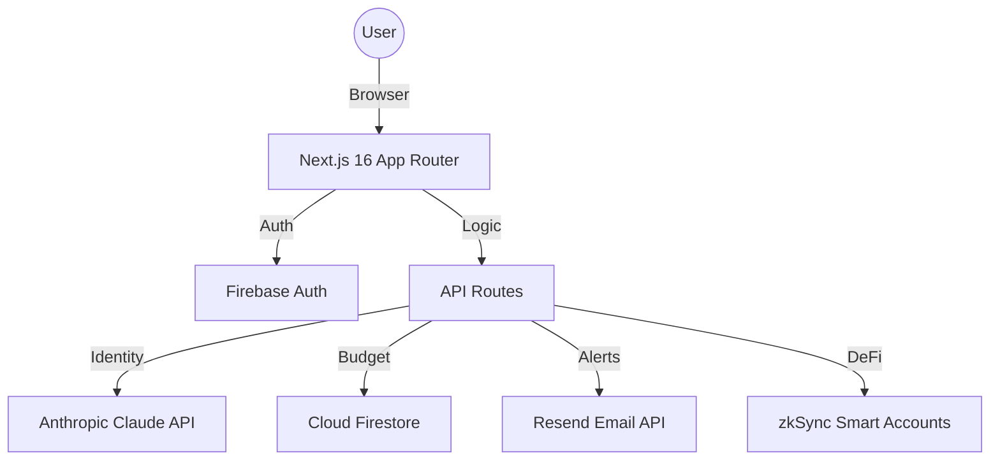

🚀 FIXMYPAYMENTS: The Disruptor Financial OS


> **"Financial sovereignty shouldn't be a luxury. It should be a standard."**

FixMyPayments is a next-generation Financial Operating System built on the **Disruptor Design System**. It bridges the gap between traditional Web2 banking and the future of Web3 DeFi, providing privacy-first identity orchestration and real-time algorithmic budgeting.

---

## 🌪️ THE DISRUPTOR STACK

- **Frontend**: Next.js 16 (React 19) + Framer Motion
- **Design**: Neo-Brutalist "Disruptor" UI with "Yellow-SaaS" fallback
- **Authentication**: Firebase Auth with cookie-based session persistence
- **Database**: Cloud Firestore (NoSQL)
- **AI Engine**: Anthropic Claude 3.5 Sonnet (Transaction Classification & Identity Orchestration)
- **Email**: Resend (Real-time Budget Alerts)
- **Web3**: zkSync-ethers + ZAAP Bundler (Smart Account Abstraction)

---

## ⚡ KEY FEATURES

### 🛡️ Identity Orchestrator (ZKP)
Our flagship feature. We use **LLM-driven Identity Orchestration** to simulate Zero-Knowledge Proofs. 
- **Privacy-First**: Verify identity without exposing PII (Personally Identifiable Information).
- **Risk Analysis**: Real-time risk assessment for every verification request.
- **Privacy Impact Summary**: Transparent documentation of how data is handled.

### 💰 Algorithmic Budgeting
Stop guessing where your money goes.
- **NLP Transactions**: Just type "Starbucks 500" or "Swiggy 300" — our AI handles the rest.
- **Smart Alerts**: 80% warning and 100% hard-block limits sent via Resend.
- **Force Protocol**: Exceeded your budget? Use the **Force Proceed** override for emergency transactions.

### ⛓️ Web3 ZAAP Bundler
Integrated DeFi capabilities for the modern investor.
- **Paymaster Config**: Gasless transactions via specialized paymasters.
- **ZAAP Bundling**: Group multiple transactions into a single batch to save gas.
- **AML Status**: Institutional-grade AML checks on all crypto interactions.

---

## 🛠️ ARCHITECTURE



---

## 🚀 GETTING STARTED

### 1. Prerequisites
- Node.js 20+
- Firebase Project
- Anthropic API Key
- Resend API Key

### 2. Environment Setup
Create a `.env.local` file:
```env
NEXT_PUBLIC_FIREBASE_API_KEY=...
NEXT_PUBLIC_FIREBASE_AUTH_DOMAIN=...
NEXT_PUBLIC_FIREBASE_PROJECT_ID=...

# Server Side
FIREBASE_SERVICE_ACCOUNT_KEY='{ "type": "service_account", ... }'
ANTHROPIC_API_KEY=...
RESEND_API_KEY=...
```

### 3. Installation
```bash
npm install
npm run dev
```

---

## 🎨 DESIGN PHILOSOPHY: THE DISRUPTOR
FixMyPayments rejects the "minimalist-boring" trend. We use **Neo-Brutalism**:
- **High Contrast**: Pure blacks, pure whites, and Neon Yellow (`#CCFF00`).
- **Heavy Strokes**: 4px to 8px borders for that "industrial" feel.
- **Space Mono**: Use of monospace fonts for data-heavy sections to emphasize technical precision.

---

## 📜 LICENSE
Distributed under the MIT License. See `LICENSE` for more information.

---
