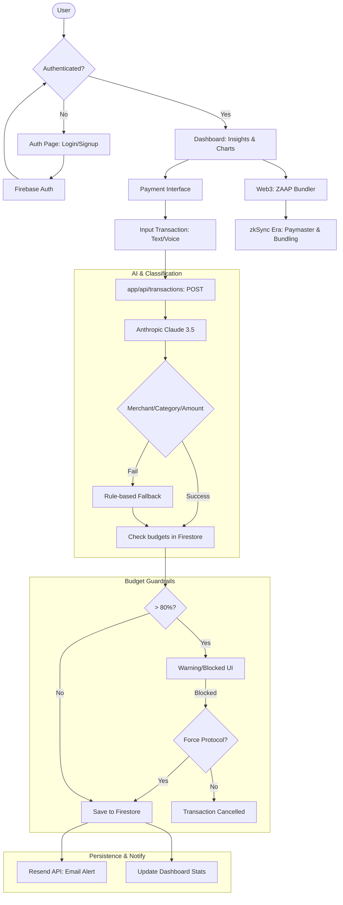

> **"Financial sovereignty shouldn't be a luxury. It should be a standard."**

FixMyPayments is a next-generation Financial Operating System built on the **Disruptor Design System**. It bridges the gap between traditional Web2 banking and the future of Web3 DeFi, providing privacy-first identity orchestration and real-time algorithmic budgeting.

---

## 📋 Table of Contents

- [🌪️ The Disruptor Stack](#️-the-disruptor-stack)
- [⚡ Key Features](#-key-features)
- [🏗️ Architecture](#️-architecture)
  - [Directory Structure](#directory-structure)
  - [Request Lifecycle](#request-lifecycle)
- [🚀 Getting Started](#-getting-started)
  - [1. Prerequisites](#1-prerequisites)
  - [2. Installation](#2-installation)
  - [3. Environment Setup](#3-environment-setup)
  - [4. Database Setup](#4-database-setup)
  - [5. Start Development Server](#5-start-development-server)
- [🔐 Environment Variables](#-environment-variables)
- [🧪 Testing](#-testing)
- [🚢 Deployment (Vercel)](#-deployment-vercel)
- [🛠️ Troubleshooting](#️-troubleshooting)
- [🎨 Design Philosophy](#-design-philosophy-the-disruptor)
- [📜 License](#-license)

---

## 🌪️ THE DISRUPTOR STACK

- **Core**: [Next.js 16.2](https://nextjs.org/) (App Router) + [React 19](https://react.dev/)
- **Styling**: [Tailwind CSS](https://tailwindcss.com/) + Custom Neo-Brutalist "Disruptor" Design System
- **Animations**: [Framer Motion](https://www.framer.com/motion/) + [GSAP](https://gsap.com/)
- **Database & Auth**: [Firebase](https://firebase.google.com/) (Auth + Firestore)
- **AI Engine**: [Anthropic Claude 3.5 Sonnet](https://www.anthropic.com/claude) (Expense Classification)
- **Notifications**: [Resend](https://resend.com/) (Email Service)
- **Web3**: [zkSync-ethers v6](https://zksync.io/) + ZAAP Account Abstraction
- **Charts**: [Recharts](https://recharts.org/)
- **Deployment**: [Vercel](https://vercel.com/)

---

## ⚡ KEY FEATURES

### 🛡️ Identity Orchestrator (ZKP)
Our flagship feature. We use **LLM-driven Identity Orchestration** to simulate Zero-Knowledge Proofs. 
- **Privacy-First**: Verify identity without exposing PII (Personally Identifiable Information).
- **Risk Analysis**: Real-time risk assessment for every verification request.
- **Privacy Impact Summary**: Transparent documentation of how data is handled.

### 💰 Algorithmic Budgeting
Stop guessing where your money goes.
- **NLP Transactions**: Just type "Starbucks 500" or "Swiggy 300" — our AI handles the rest.
- **Smart Alerts**: 80% warning and 100% hard-block limits sent via Resend.
- **Force Protocol**: Exceeded your budget? Use the **Force Proceed** override for emergency transactions.

### ⛓️ Web3 ZAAP Bundler
Integrated DeFi capabilities for the modern investor.
- **Paymaster Config**: Gasless transactions via specialized paymasters.
- **ZAAP Bundling**: Group multiple transactions into a single batch to save gas.
- **AML Status**: Institutional-grade AML checks on all crypto interactions via PureFi.

### 🌓 Theme Orchestration
Integrated **Neo-Brutalist Dark/Light Toggle** that persists across sessions. 
- **Industrial Contrast**: High-contrast light mode that maintains the Disruptor aesthetic.
- **Persistence**: Remembers your preference via `localStorage` and system sync.

---

## 🏗️ ARCHITECTURE

### Directory Structure

```text
├── app/
│   ├── api/             # Next.js API Routes (Classification, Email, etc.)
│   ├── auth/            # Firebase Authentication UI
│   ├── components/      # Shared Neo-Brutalist UI Components
│   ├── dashboard/       # Financial Dashboard & Analytics
│   ├── kyc/             # Identity Orchestration Flow
│   ├── pay/             # Payment Interface with Budget Guardrails
│   ├── profile/         # User Settings & Profile Management
│   └── zaap/            # Web3/DeFi Transaction Bundler
├── contracts/           # zkSync Smart Contracts (ZAAP, Paymaster)
├── data/                # Static data & configuration
├── lib/                 # Core utilities (Firebase Admin, AI Logic, Web3)
├── public/              # Static assets (images, icons)
├── setup-db.mjs         # Database initialization script
└── DEPLOYMENT.md        # Detailed Vercel deployment guide
```

### Request Lifecycle

1. **User Action**: User submits a transaction (e.g., "Lunch 200").
2. **AI Classification**: `app/api/classify` sends text to Anthropic Claude 3.5.
3. **Logic Engine**: System verifies results against user budgets in Firestore.
4. **Guardrails**: If budget exceeds 80%, a real-time warning is triggered.
5. **Persistence**: Transaction is saved to Firestore.
6. **Notification**: Resend API sends confirmation/alert emails.

### Full System Flow



---

## 🚀 GETTING STARTED

### 1. Prerequisites

- **Node.js**: v20 or higher
- **Package Manager**: `npm` or `yarn`
- **Firebase**: A project with Firestore and Auth enabled
- **Anthropic API**: Access to Claude 3.5 Sonnet
- **Resend API**: For transactional emails

### 2. Installation

```bash
git clone https://github.com/Ibaner20065/fixmypayments.git
cd fixmypayments
npm install
```

### 3. Environment Setup

Copy the example environment file and fill in your credentials:

```bash
cp .env.local.template .env.local
```

### 4. Database Setup

Initialize Firestore with default budgets and schemas:

```bash
node setup-db.mjs
```

### 5. Start Development Server

```bash
npm run dev
```

Open [http://localhost:3000](http://localhost:3000) in your browser.

---

## 🔐 ENVIRONMENT VARIABLES

### Client Side (Public)
| Variable | Description |
|----------|-------------|
| `NEXT_PUBLIC_FIREBASE_API_KEY` | Firebase Client API Key |
| `NEXT_PUBLIC_FIREBASE_AUTH_DOMAIN` | Firebase Auth Domain |
| `NEXT_PUBLIC_FIREBASE_PROJECT_ID` | Firebase Project ID |
| `NEXT_PUBLIC_ZKSYNC_RPC_URL` | zkSync RPC URL (e.g., Sepolia) |

### Server Side (Private)
| Variable | Description |
|----------|-------------|
| `FIREBASE_PRIVATE_KEY` | Firebase Admin SDK Private Key |
| `FIREBASE_CLIENT_EMAIL` | Firebase Admin Service Account Email |
| `ANTHROPIC_API_KEY` | Anthropic Claude API Key |
| `RESEND_API_KEY` | Resend Email API Key |

---

## 🧪 TESTING

FixMyPayments uses a combination of API testing and UI validation.

### Run Development Tests
```bash
# Verify API routes and Classification
curl -X POST http://localhost:3000/api/classify \
     -H "Content-Type: application/json" \
     -d '{"text": "Dinner at Swiggy 500"}'
```

### Verify Build
```bash
npm run build
```

---

## 🚢 DEPLOYMENT (VERCEL)

FixMyPayments is optimized for **Vercel**.

1. Connect your GitHub repository to Vercel.
2. Add all **Environment Variables** in the Vercel dashboard.
3. Set the build command: `npm run build`.
4. Deploy!

For a detailed walkthrough on fixing common deployment errors, see [DEPLOYMENT.md](./DEPLOYMENT.md).

---

## 🛠️ TROUBLESHOOTING

### "FIREBASE NOT CONFIGURED ON SERVER"
Ensure you have set the `FIREBASE_PRIVATE_KEY` and `FIREBASE_CLIENT_EMAIL` in your environment. The private key must include the `\n` characters for proper parsing.

### Classification is slow
Classification performance depends on Anthropic's API latency. Ensure your API key is valid and you have sufficient credits.

### Budget alerts not sending
Verify your `RESEND_API_KEY` and ensure the recipient email is verified if you are in a Resend sandbox environment.

---

## 🎨 DESIGN PHILOSOPHY: THE DISRUPTOR

FixMyPayments rejects the "minimalist-boring" trend. We use **Neo-Brutalism**:
- **High Contrast**: Pure blacks, pure whites, and Neon Yellow (`#CCFF00`).
- **Heavy Strokes**: 4px to 8px borders for that "industrial" feel.
- **Space Mono**: Use of monospace fonts for data-heavy sections to emphasize technical precision.

---

## 📜 LICENSE

Distributed under the MIT License. See `LICENSE` for more information.

---
